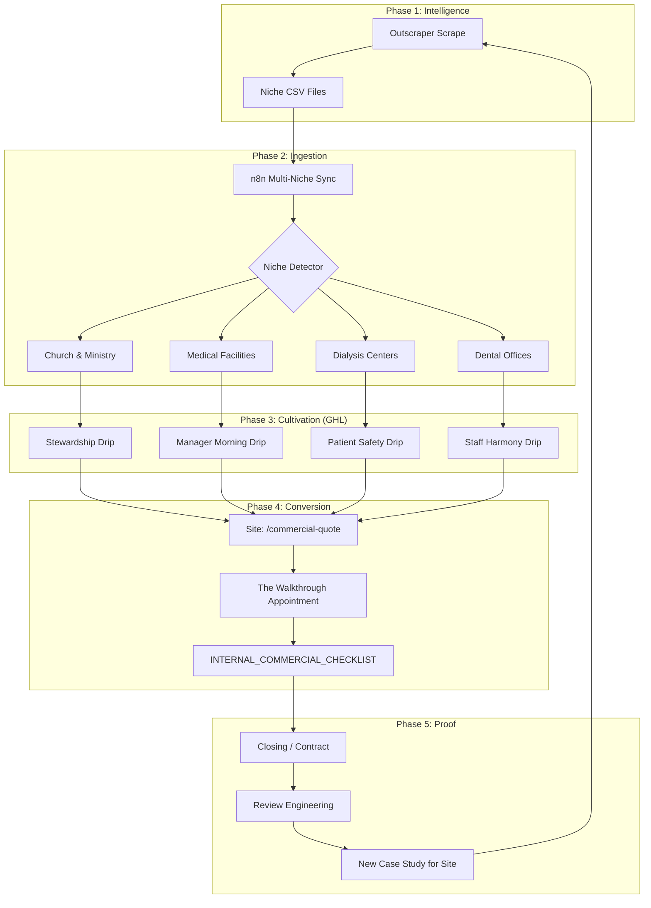

# 🏗️ TVCT Growth Engine: Master System Map

This document outlines the end-to-end "Whole Process" for TVCT's automated growth strategy. It connects lead intelligence, CRM automation, and high-standard fulfillment into a single revenue-generating engine.

---

## 🗺️ The Growth Lifecycle (Visualization)

---

## 📝 Phase Breakdown

### Phase 1: Lead Intelligence (Outscraper)
**Tools:** Outscraper Google Maps Scraper.
**Process:** Targeted scraping of localized niches (e.g., zip codes 35630, 35801) to identify facilities.
**Key Data points:** Name, Category, Rating, Phone, Email, City.

### Phase 2: Automated Ingestion (n8n)
**Tools:** [TVCT: Multi-Niche Lead Sync Workflow](https://singingriverai.app.n8n.cloud/workflow/3XRabjYiQUWMWl4l).
**Logic:**
- Filters for valid contact info (Email or Phone).
- Maps "Niches" based on facility categories.
- Tags "Reputation Opportunities" for facilities with < 4.0 ratings.
- **Upsert:** Synchronizes everything directly into your GHL Location ID.

### Phase 3: CRM Cultivation (GoHighLevel)
**Tools:** GHL Workflows & Smart Lists.
**Recipes:**
- **Smart List 1:** `Category_Church_Ministry_Services`
- **Smart List 2:** `Category_Medical_Healthcare_Facilities`
- **Smart List 3:** `Category_Medical_Dialysis_Specialty`
- **Workflow Action:** Send "Day 1" intro based on the Niche-Specific variant from the [OUTREACH_GHL_LOGIC].

### Phase 4: Appointment Conversion (The Walkthrough)
**Tools:** Astro Site (`/commercial-quote`), GHL Booking Bot.
**Process:**
1. Lead clicks a link in the SMS/Email.
2. Form captures specific pain points (e.g., "Missed Trash", "Cleaning surprise").
3. **The Walkthrough:** You visit the facility with the **[INTERNAL_COMMERCIAL_CHECKLIST]** in hand, showing them exactly how TVCT is different because of our "Disciplined Reliability."

### Phase 5: Feedback Loop (Expansion)
**Tools:** Review Engineering Templates.
**Process:**
1. Once signed, you run a 30-day "Excellence SPRINT."
2. Request a review from the Manager/Pastor.
3. Feature that review on the website to build authority for the *next* batch of leads.

---

## 🚀 "GHL Workflow Recipe" (Nurture Sequence)

For each niche, set up a GHL Workflow with this structure:

| Step | Time | Action | Goal |
| :--- | :--- | :--- | :--- |
| **0** | Instant | Trigger: Tag `Category_...` Added | Initialize sequence |
| **1** | +5 Mins | SMS: Intro (Niche Variant) | Establish local identity & relevance |
| **2** | +1 Day | Email: Staff Harmony/Stewardship hook | Educational/Psychological driver |
| **3** | +3 Days | SMS: "Morning Surprise" Follow-up | Address pain point of current provider |
| **4** | +7 Days | Call: Manual Task (Or AI Dialer) | Final push for walkthrough |

> [!IMPORTANT]
> **Batching Recommendation**: Run the n8n sync in batches of **50 leads per niche** every Monday. This prevents overwhelming your sales capacity and keeps follow-up response times high.

---
*Generated by the TVCT Agency-Agent Engine.*
